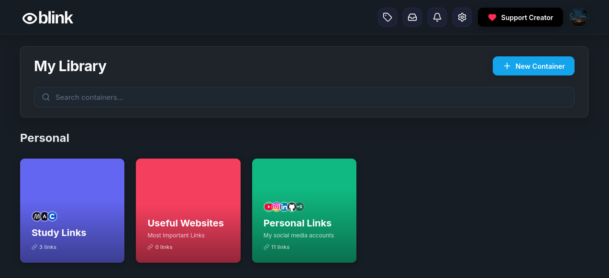
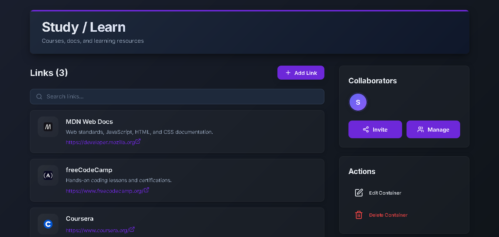

<div align="center">

</div>

<h1 align="center">Blink - Your links, organized</h1>


<p align="center">

</p>
<p align="center">
   
   
   
   
</p>

<p align="center">A minimalist, web-based link storage and collaboration app built with React.js, TypeScript, and Firebase.</p>

## Features

- **Vault Management** - Create, edit, and delete link containers
- **Link Management** - Add, edit, and delete links within vaults
- **Theme System** - Native Dark Mode Support
- **Email Invitations** - Send vault invitations to users by email
- **Permission Management** - View and edit permissions
- **Collaborator Management** - Add, remove, and manage vault collaborators
- **Notifications** - Real-time notification system for invitations and updates
- **Search Functionality** - Search across containers, links, titles, descriptions, and URLs
- **Responsive Design** - Mobile-first design that works on all devices
- **Copy to Clipboard** - Quick copy functionality for links

<br></br>

<br></br>



## Tech Stack

- **Frontend**: React 18, TypeScript, Vite
- **Styling**: Classic CSS , Tailwind CSS, PostCSS
- **Backend**: Firebase (Authentication + Firestore)
- **Icons**: Lucide React
- **Routing**: React Router DOM
- **State Management**: React Context API

## Getting Started

### Prerequisites

- Node.js (v16 or higher)
- npm or yarn
- Firebase project

### Installation

1. Clone the repository:
```bash
git clone https://github.com/samirrhashimov/blink.git
cd blink-app
```

2. Install dependencies:
```bash
npm install
```

3. Set up Firebase:
   - Create a new Firebase project at [Firebase Console](https://console.firebase.google.com/)
   - Enable Authentication and Firestore
   - Copy your Firebase config and update `src/firebase/config.ts`

4. Start the development server:
```bash
npm run dev
```

5. Open [http://localhost:5173](http://localhost:5173) in your browser

## Firebase Setup

1. Create a Firebase project
2. Enable Authentication (Email/Password)
3. Enable Firestore Database
4. Set up Firestore security rules:

```javascript
rules_version = '2';
service cloud.firestore {
  match /databases/{database}/documents {
    
    match /users/{userId} {
      allow read: if request.auth != null;
      allow create: if request.auth != null;
      allow update, delete: if request.auth != null && request.auth.uid == userId;
    }
    
    match /vaults/{vaultId} {
      allow create: if request.auth != null && request.resource.data.ownerId == request.auth.uid;
      allow read: if request.auth != null && 
        (resource.data.ownerId == request.auth.uid || 
         request.auth.uid in resource.data.authorizedUsers);
      
      allow delete: if request.auth != null && resource.data.ownerId == request.auth.uid;
   
      allow update: if request.auth != null && 
        (resource.data.ownerId == request.auth.uid || 
         request.auth.uid in resource.data.authorizedUsers ||
         request.auth.uid in request.resource.data.authorizedUsers);
    }
    
    match /shareInvites/{inviteId} {
      allow read, write: if request.auth != null;
    }
    
    match /vaultPermissions/{permissionId} {
      allow read, write: if request.auth != null;
    }
    
    match /shareLinks/{linkId} {
      allow read, write: if request.auth != null;
    }
    
    match /notifications/{notificationId} {
      allow create: if request.auth != null;
      allow read, update, delete: if request.auth != null && resource.data.userId == request.auth.uid;
    }
  }
}
```

## Available Scripts

- `npm run dev` - Start development server
- `npm run build` - Build for production
- `npm run preview` - Preview production build
- `npm run lint` - Run ESLint

## Contributing

1. Fork the repository
2. Create a feature branch
3. Make your changes
4. Submit a pull request

## Security
If you discover a security vulnerability in the project, **do not open a public issue**.  
Instead, submit a private report through the [Security advisories](../../security/advisories) section.  

---

## License
This project is licensed under the **APGLv3 License**. For more details, see the [LICENSE](LICENSE) file.

---
## Support

For issues and questions, please open an issue on GitHub.
